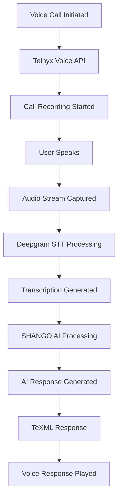

# Cross-Platform Voice Integration Analysis
## Integration Points Between Voice API, IVR System, SinchChatLive, and Unified Messaging Platform

---

## 🎯 **Executive Summary**

This document provides a comprehensive analysis of integration opportunities between our newly implemented Voice API with Telnyx/Deepgram STT and existing backend components: IVR system, SinchChatLive functionality, and the Unified Messaging Platform. The analysis identifies key integration points and provides a detailed transcription/translation workflow.

---

## 🏗️ **Current Architecture Overview**

### **Voice API Implementation (NEW)**
- **Telnyx Voice Service**: Advanced voice calling with TeXML
- **Deepgram STT**: Real-time speech-to-text transcription
- **SHANGO AI Integration**: Intelligent response generation
- **Session Management**: Cross-platform session handling

### **Existing Backend Components**
- **IVR System**: Interactive Voice Response infrastructure
- **SinchChatLive**: Live chat and messaging platform
- **Unified Messaging Platform**: Multi-channel communication hub
- **Cross-Platform Session Management**: TETRIX ↔ JoRoMi integration

---

## 🔗 **Integration Points Analysis**

### **1. Voice API ↔ IVR System Integration**

#### **Current IVR Capabilities**
```typescript
// Existing IVR system handles:
- Call routing and menu navigation
- DTMF input processing
- Call transfer and forwarding
- Basic call recording
- Call queuing and hold music
```

#### **Integration Opportunities**
```typescript
// Enhanced IVR with Voice API
interface EnhancedIVR {
  // Voice API Integration
  voiceTranscription: boolean;        // Real-time STT
  aiResponseGeneration: boolean;      // SHANGO AI responses
  multiLanguageSupport: boolean;      // Language detection
  speakerDiarization: boolean;        // Multi-speaker support
  
  // TeXML Integration
  dynamicCallFlows: boolean;          // XML-based responses
  contextAwareRouting: boolean;       // AI-driven routing
  intelligentEscalation: boolean;     // Smart agent transfer
}
```

#### **Implementation Strategy**
1. **Replace Basic IVR with Enhanced Voice API**
   - Migrate existing IVR logic to TeXML format
   - Integrate Deepgram STT for voice input
   - Add SHANGO AI for intelligent responses

2. **Unified Call Flow Management**
   ```typescript
   // Enhanced call flow with AI
   const enhancedCallFlow = {
     greeting: "Hello! I'm SHANGO, your AI assistant. How can I help?",
     voiceInput: true,                    // Enable voice recognition
     transcription: true,                 // Real-time STT
     aiProcessing: true,                  // SHANGO AI responses
     fallbackToDTMF: true,               // DTMF fallback
     intelligentRouting: true             // AI-driven routing
   };
   ```

### **2. Voice API ↔ SinchChatLive Integration**

#### **Current SinchChatLive Capabilities**
```typescript
// Existing SinchChatLive features:
- Live chat sessions
- Agent availability management
- Message history and persistence
- File sharing capabilities
- Multi-channel support (chat, SMS, voice)
```

#### **Integration Opportunities**
```typescript
// Enhanced SinchChatLive with Voice API
interface EnhancedSinchChatLive {
  // Voice Integration
  voiceCallInitiation: boolean;        // Start voice calls from chat
  voiceTranscription: boolean;         // Transcribe voice to text
  voiceResponseGeneration: boolean;    // Text-to-speech responses
  crossChannelContinuity: boolean;    // Seamless channel switching
  
  // AI Enhancement
  aiAgentSupport: boolean;             // SHANGO AI agents
  intelligentEscalation: boolean;      // Smart agent routing
  contextPreservation: boolean;        // Maintain context across channels
}
```

#### **Implementation Strategy**
1. **Voice Call Integration**
   ```typescript
   // Add voice calling to SinchChatLive
   class EnhancedSinchChatService extends SinchChatService {
     async startVoiceCall(sessionId: string, phoneNumber: string) {
       // Initiate voice call via Voice API
       const voiceSession = await telnyxVoiceService.initiateCall({
         to: phoneNumber,
         from: process.env.TELNYX_PHONE_NUMBER,
         webhookUrl: `${process.env.WEBHOOK_BASE_URL}/api/voice/webhook`,
         recordCall: true,
         transcriptionEnabled: true
       });
       
       // Link voice session to chat session
       await this.linkSessions(sessionId, voiceSession.sessionId);
     }
   }
   ```

2. **Cross-Channel Message Sync**
   ```typescript
   // Sync messages between chat and voice
   const syncMessages = async (chatSessionId: string, voiceSessionId: string) => {
     // Voice transcription → Chat message
     const voiceSession = telnyxVoiceService.getSession(voiceSessionId);
     if (voiceSession.transcription) {
       await sinchChatService.sendMessage(chatSessionId, {
         role: 'user',
         content: voiceSession.transcription.text,
         type: 'voice_transcription'
       });
     }
   };
   ```

### **3. Voice API ↔ Unified Messaging Platform Integration**

#### **Current Unified Messaging Capabilities**
```typescript
// Existing unified messaging features:
- Multi-channel communication (WhatsApp, SMS, Voice, Chat)
- Conversation management
- Real-time message status
- Cross-platform session management
- Trial and WABA status tracking
```

#### **Integration Opportunities**
```typescript
// Enhanced Unified Messaging with Voice API
interface EnhancedUnifiedMessaging {
  // Voice Channel Integration
  voiceConversations: boolean;         // Voice as first-class channel
  voiceTranscription: boolean;         // Transcribe voice messages
  voiceResponseGeneration: boolean;    // Generate voice responses
  crossChannelTranscription: boolean;  // Transcribe across channels
  
  // AI Enhancement
  intelligentChannelRouting: boolean;  // AI-driven channel selection
  contextAwareResponses: boolean;      // Context-aware AI responses
  multiLanguageSupport: boolean;       // Multi-language transcription
}
```

#### **Implementation Strategy**
1. **Voice as First-Class Channel**
   ```typescript
   // Add voice to unified messaging
   const voiceChannel = {
     type: 'voice',
     capabilities: [
       'real_time_transcription',
       'ai_response_generation',
       'call_recording',
       'speaker_diarization',
       'language_detection'
     ],
     integration: {
       telnyx: true,
       deepgram: true,
       shango_ai: true
     }
   };
   ```

2. **Cross-Channel Transcription**
   ```typescript
   // Transcribe voice across all channels
   const transcribeVoiceMessage = async (voiceMessage: VoiceMessage) => {
     const transcription = await telnyxVoiceService.processTranscription(
       voiceMessage.audioUrl,
       voiceMessage.sessionId
     );
     
     // Create text version for other channels
     const textMessage = {
       ...voiceMessage,
       type: 'text',
       content: transcription.text,
       transcription: transcription
     };
     
     // Sync across all channels
     await syncAcrossChannels(textMessage);
   };
   ```

---

## 🎤 **Transcription and Translation Workflow**

### **Current Transcription Workflow**

#### **1. Voice Input Processing**


#### **2. Deepgram STT Configuration**
```typescript
const deepgramConfig = {
  model: 'nova-2',                    // Latest model
  language: 'en-US',                  // Auto-detect language
  punctuate: true,                    // Add punctuation
  profanity_filter: false,            // Keep profanity for context
  redact: ['pci', 'ssn'],            // Redact sensitive data
  diarize: true,                      // Speaker diarization
  multichannel: true,                 // Multi-channel audio
  alternatives: 3,                    // Multiple alternatives
  interim_results: true,              // Real-time results
  endpointing: 300,                   // Endpoint detection
  vad_turnoff: 500,                   // Voice activity detection
  smart_format: true                  // Smart formatting
};
```

#### **3. Transcription Processing Pipeline**
```typescript
// Enhanced transcription pipeline
class TranscriptionPipeline {
  async processVoiceInput(audioUrl: string, sessionId: string) {
    // Step 1: Deepgram STT
    const transcription = await this.processWithDeepgram(audioUrl);
    
    // Step 2: Language Detection
    const language = await this.detectLanguage(transcription);
    
    // Step 3: Speaker Diarization
    const speakers = await this.identifySpeakers(transcription);
    
    // Step 4: Entity Extraction
    const entities = await this.extractEntities(transcription);
    
    // Step 5: Context Analysis
    const context = await this.analyzeContext(transcription, sessionId);
    
    // Step 6: AI Response Generation
    const response = await this.generateAIResponse(transcription, context);
    
    return {
      transcription,
      language,
      speakers,
      entities,
      context,
      response
    };
  }
}
```

### **Translation Workflow (Future Enhancement)**

#### **1. Multi-Language Support**
```typescript
// Translation configuration
const translationConfig = {
  supportedLanguages: [
    'en-US', 'es-ES', 'fr-FR', 'de-DE',
    'pt-BR', 'it-IT', 'ja-JP', 'ko-KR',
    'zh-CN', 'ar-SA', 'hi-IN', 'ru-RU'
  ],
  translationProvider: 'google',      // Google Translate API
  fallbackProvider: 'azure',          // Azure Translator
  autoDetect: true,                   // Auto-detect source language
  preserveOriginal: true,             // Keep original transcription
  confidenceThreshold: 0.8            // Translation confidence threshold
};
```

#### **2. Translation Pipeline**
```typescript
// Translation processing pipeline
class TranslationPipeline {
  async translateTranscription(transcription: Transcription, targetLanguage: string) {
    // Step 1: Language Detection
    const sourceLanguage = await this.detectLanguage(transcription.text);
    
    // Step 2: Translation
    const translation = await this.translateText(
      transcription.text,
      sourceLanguage,
      targetLanguage
    );
    
    // Step 3: Voice Synthesis
    const voiceResponse = await this.synthesizeVoice(
      translation.text,
      targetLanguage
    );
    
    return {
      original: transcription,
      translation,
      voiceResponse
    };
  }
}
```

---

## 🔄 **Integration Implementation Roadmap**

### **Phase 1: IVR System Integration (Weeks 1-2)**
1. **Migrate IVR to TeXML Format**
   - Convert existing IVR logic to TeXML
   - Integrate Deepgram STT for voice input
   - Add SHANGO AI for intelligent responses

2. **Enhanced Call Flows**
   - Implement dynamic call routing
   - Add context-aware responses
   - Enable multi-language support

### **Phase 2: SinchChatLive Integration (Weeks 3-4)**
1. **Voice Call Integration**
   - Add voice calling to chat interface
   - Implement cross-channel message sync
   - Enable voice transcription in chat

2. **AI Agent Enhancement**
   - Integrate SHANGO AI agents
   - Add intelligent escalation
   - Implement context preservation

### **Phase 3: Unified Messaging Integration (Weeks 5-6)**
1. **Voice Channel Integration**
   - Add voice as first-class channel
   - Implement cross-channel transcription
   - Enable voice response generation

2. **Advanced Features**
   - Multi-language transcription
   - Real-time translation
   - Intelligent channel routing

### **Phase 4: Advanced Features (Weeks 7-8)**
1. **Translation Support**
   - Implement multi-language translation
   - Add voice synthesis
   - Enable cross-language conversations

2. **Analytics and Monitoring**
   - Add transcription analytics
   - Implement quality metrics
   - Enable real-time monitoring

---

## 📊 **Integration Benefits**

### **1. Enhanced User Experience**
- **Seamless Channel Switching**: Users can switch between chat, voice, and SMS
- **Context Preservation**: Conversation context maintained across channels
- **Intelligent Routing**: AI-driven routing to appropriate agents
- **Multi-language Support**: Support for multiple languages

### **2. Operational Efficiency**
- **Unified Management**: Single interface for all communication channels
- **Automated Transcription**: Real-time transcription for all voice interactions
- **AI-Powered Responses**: Intelligent responses reduce agent workload
- **Cross-Platform Sync**: Seamless integration between TETRIX and JoRoMi

### **3. Advanced Analytics**
- **Transcription Analytics**: Detailed analysis of voice interactions
- **Quality Metrics**: Real-time quality monitoring
- **Performance Tracking**: Track performance across channels
- **User Insights**: Deep insights into user behavior

---

## 🚀 **Next Steps**

1. **Immediate Actions**
   - Review and approve integration roadmap
   - Set up development environment
   - Begin Phase 1 implementation

2. **Technical Requirements**
   - Configure Deepgram API keys
   - Set up Telnyx webhooks
   - Implement cross-platform session management

3. **Testing Strategy**
   - Unit tests for each integration point
   - Integration tests for cross-platform functionality
   - End-to-end tests for complete workflows

4. **Deployment Plan**
   - Staging environment setup
   - Production deployment strategy
   - Monitoring and alerting configuration

---

This comprehensive integration analysis provides a clear roadmap for enhancing our cross-platform management services with advanced voice capabilities, intelligent transcription, and seamless multi-channel communication.
