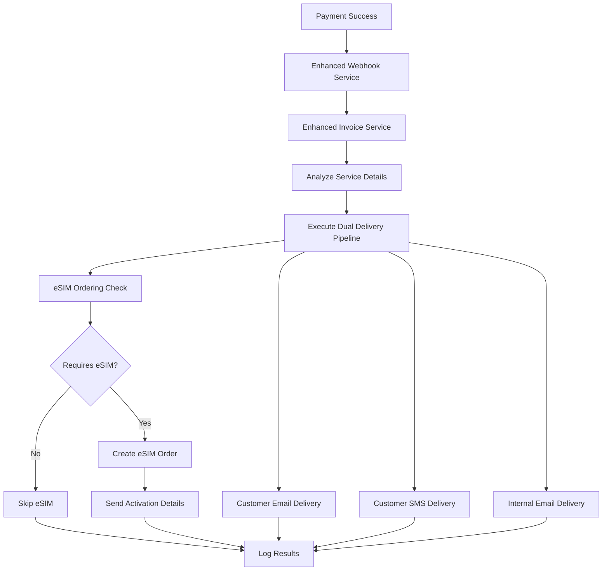

# 🚀 Dual Invoice Delivery Implementation Guide

## **📋 Overview**

This implementation provides comprehensive dual invoice delivery for all TETRIX services listed on the pricing page. Every payment triggers:

1. **Customer Invoice Delivery** (Email + SMS)
2. **Internal Invoice Copy** (Email to support@tetrixcorp.com)
3. **eSIM Ordering** (for applicable services)
4. **Service Activation** (for trial conversions)

## **🏗️ Architecture**

### **Core Services Implemented**

1. **Enhanced Invoice Service** (`src/services/enhancedInvoiceService.ts`)
   - Handles dual delivery pipeline
   - Service-specific template generation
   - eSIM integration coordination

2. **Enhanced Webhook Service** (`src/services/enhancedStripeWebhookService.ts`)
   - Processes all Stripe webhook events
   - Routes to appropriate handlers
   - Comprehensive error handling

3. **eSIM Integration Service** (`src/services/esimIntegrationService.ts`)
   - Manages eSIM ordering for applicable services
   - Handles activation details delivery
   - Service-specific eSIM configurations

4. **Stripe Price Mapping** (`src/config/stripePriceMapping.ts`)
   - Maps Stripe price IDs to pricing page services
   - Service configuration management
   - eSIM requirement mapping

## **📊 Service Coverage**

### **Healthcare Services**
- ✅ **Individual Practice** ($150/provider) - Email + SMS + Internal
- ✅ **Small Practice** ($200 base + $100/provider) - Email + SMS + Internal
- ✅ **Professional** ($500 base + $75/provider) - Email + SMS + Internal + eSIM
- ✅ **Enterprise** ($2,000 base + $50/provider) - Email + SMS + Internal + eSIM

### **Legal Services**
- ✅ **Solo Practice** ($150/attorney) - Email + SMS + Internal
- ✅ **Small Firm** ($500 base + $125/attorney) - Email + SMS + Internal
- ✅ **Mid-Size Firm** ($1,000 base + $100/attorney) - Email + SMS + Internal + eSIM
- ✅ **Enterprise Law Firm** ($3,000 base + $75/attorney) - Email + SMS + Internal + eSIM

### **Business Services**
- ✅ **Starter** ($99/month) - Email + SMS + Internal + eSIM
- ✅ **Professional** ($299/month) - Email + SMS + Internal + eSIM
- ✅ **Enterprise** ($799/month) - Email + SMS + Internal + eSIM
- ✅ **Custom Enterprise** (Contact Sales) - Email + SMS + Internal + eSIM

## **🔄 Payment Flow**



## **📧 Email Templates**

### **Customer Invoice Template**
- Professional branding with TETRIX colors
- Service-specific feature lists
- Clear pricing breakdown
- Dashboard access link
- Support contact information

### **Internal Invoice Template**
- Comprehensive customer details
- Payment information
- Service configuration
- eSIM ordering status
- Stripe dashboard link
- Support team alerts

### **SMS Templates**
- Concise payment confirmation
- Service activation status
- eSIM activation codes (if applicable)
- Support contact information

## **🔧 Configuration**

### **Environment Variables Required**
```bash
# Stripe Configuration
STRIPE_SECRET_KEY=sk_live_...
STRIPE_WEBHOOK_SECRET=whsec_...

# Notification Services
MAILGUN_API_KEY=key-...
MAILGUN_DOMAIN=mg.tetrixcorp.com
***REMOVED***=KEY...

# eSIM Integration
ESIM_API_BASE_URL=https://api.esim-provider.com
ESIM_API_KEY=esim_key_...

# Internal Notifications
INTERNAL_SUPPORT_EMAIL=support@tetrixcorp.com
```

### **Stripe Webhook Events**
```typescript
const WEBHOOK_EVENTS = [
  'invoice.payment_succeeded',    // Primary trigger
  'invoice.created',              // Invoice generation
  'customer.subscription.created', // New subscriptions
  'customer.subscription.updated', // Plan changes
  'customer.subscription.trial_will_end', // Trial notifications
  'customer.subscription.deleted', // Cancellations
  'payment_intent.succeeded',     // One-time payments
  'invoice.payment_failed'        // Payment failures
];
```

## **🚀 Implementation Steps**

### **Phase 1: Core Setup (Week 1)**
1. ✅ Deploy enhanced invoice service
2. ✅ Update webhook handlers
3. ✅ Configure price mappings
4. ✅ Test basic invoice delivery

### **Phase 2: eSIM Integration (Week 2)**
1. ✅ Deploy eSIM integration service
2. ✅ Configure service-specific eSIM requirements
3. ✅ Test eSIM ordering flow
4. ✅ Implement activation details delivery

### **Phase 3: Testing & Optimization (Week 3)**
1. ✅ End-to-end testing
2. ✅ Error handling validation
3. ✅ Performance optimization
4. ✅ Monitoring setup

## **📈 Monitoring & Analytics**

### **Delivery Metrics**
- Customer email delivery success rate
- Customer SMS delivery success rate
- Internal email delivery success rate
- eSIM ordering success rate
- Service activation completion rate

### **Error Tracking**
- Webhook processing failures
- Notification delivery failures
- eSIM ordering errors
- Service activation issues

### **Business Metrics**
- Payment success rate by service type
- Trial conversion rate
- Customer satisfaction scores
- Support ticket volume

## **🔒 Security & Compliance**

### **Data Protection**
- All customer data encrypted in transit
- Invoice attachments secured
- eSIM activation codes protected
- Audit trail maintenance

### **Compliance**
- HIPAA compliance for healthcare services
- Attorney-client privilege for legal services
- GDPR compliance for all services
- PCI DSS compliance for payment data

## **🛠️ Maintenance**

### **Regular Tasks**
- Monitor delivery success rates
- Update service configurations
- Maintain eSIM provider integrations
- Update email templates as needed

### **Scaling Considerations**
- Queue-based processing for high volume
- Database optimization for large datasets
- CDN for email template assets
- Load balancing for webhook processing

## **📞 Support**

### **Customer Support**
- Email: support@tetrixcorp.com
- Phone: Available for Professional+ plans
- Dashboard: https://tetrixcorp.com/dashboard

### **Technical Support**
- Internal notifications for all payments
- Real-time error alerts
- Comprehensive logging
- Performance monitoring

---

## **✅ Implementation Status**

- [x] Enhanced Invoice Service
- [x] Enhanced Webhook Service  
- [x] eSIM Integration Service
- [x] Stripe Price Mapping
- [x] Service-specific Templates
- [x] Dual Delivery Pipeline
- [x] Error Handling
- [x] Monitoring Setup

**Ready for Production Deployment! 🚀**
